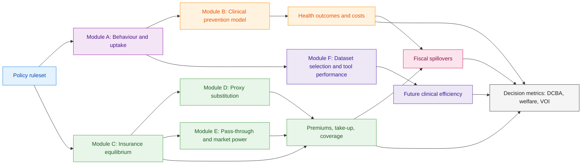

# Protocol: Integrated Economic Evaluation of Policy Options to Restrict Genetic Discrimination

**Version:** v1.0
**Date:** 02 March 2026
**Author:** Dylan A Mordaunt

---
**Repo update:** the active repository now evaluates the canonical `status_quo`, `moratorium`, and `ban` policy regimes through the core pipeline, with scenario analysis layered on top of that canonical registry.
---

## 1. Background and rationale
Concerns about genetic discrimination have shaped policy debates across health, employment, and insurance. Most quantitative discussion focuses on two channels: (1) adverse selection and premium impacts in voluntary insurance markets and (2) deterrence of clinically useful genetic testing due to fear of downstream consequences. This protocol specifies a broader economic evaluation that quantifies additional channels that are often discussed qualitatively but are rarely integrated in one coherent model.

The evaluation treats “genetic discrimination policy” as a portfolio of legal and market-design choices that influence behaviour, market equilibrium, health outcomes, fiscal spillovers, and distributional equity. The analysis is designed to support decision-making under uncertainty and to make explicit which unknowns matter most.

## 2. Objectives
### 2.1 Primary objective
To estimate the net social impacts of alternative policy regimes restricting the use of genetic information, including health outcomes, fiscal impacts, insurance market effects, welfare impacts, and distributional consequences.

### 2.2 Secondary objectives
1. To quantify the magnitude of deterrence effects on genetic testing, cascade testing, and research participation attributable to policy regimes.
2. To estimate adverse selection and premium impacts under each policy regime, including sensitivity to proxy substitution and market structure.
3. To quantify fiscal externalities arising from changed insurance coverage and changed disease prevention.
4. To quantify data-quality externalities (selection bias in genomic datasets) and downstream effects on predictive tool performance.
5. To prioritise future research via Value of Information (VOI) analysis.

## 3. Scope and decision context

**Initial jurisdictions (implementation focus):** Australia and Aotearoa New Zealand, starting with life insurance use of predictive genetic test results, with optional extensions to employment.
Jurisdiction-specific policy rulesets are stored under `configs/policies_australia.yaml` and `configs/policies_new_zealand.yaml`, with definitions and notes in `context/jurisdiction_profiles/`.

This protocol is written to be jurisdiction-agnostic. The base case is voluntary risk-rated insurance (life, disability income protection, and/or long-term care where applicable) and insurer use of adverse genetic test results. Extensions cover employment decision-making and other domains.

### 3.1 Populations
- Individuals eligible for genetic testing (clinical indication or population-based programs, depending on the jurisdiction).
- Relatives eligible for cascade testing.
- Insurance applicants and policyholders (by relevant product lines).

### 3.2 Policy comparators
A standard set of comparators will be evaluated. The active implemented benchmark set is `status_quo`, `moratorium`, and `ban`; broader partial/hybrid designs remain protocol-specified extensions and are treated as scenario or future-work surfaces unless explicitly activated in configuration.

1. **Status quo** (baseline legal and industry practice).
2. **Moratorium** (time-limited or indefinite, with caps and/or thresholds).
3. **Ban** (no use of adverse predictive genetic test results; jurisdiction-specific carve-outs defined a priori).
4. **Partial-ban and hybrid designs** (restricted use, risk-sharing pools, public backstops, or related extensions) remain protocol-specified extensions and should be labeled as exploratory unless promoted into the canonical implemented comparator set.

## 4. Conceptual framework

**Game-theoretic framing:** The strategic interactions represented (screening/adverse selection, participation under penalty, proxy substitution, public-good externality, and enforcement) are documented in `docs/GAME_THEORETIC_FRAMING.md`.

The causal structure is implemented as linked modules. Each module produces distributions over outcomes (not point estimates). Uncertainty is propagated to final decision metrics.

## 5. Data sources
Data access will be documented in a data dictionary. Planned sources include:
1. **Genetic testing utilisation:** administrative claims, laboratory volumes, registries, and program data (time series by geography and subgroup).
2. **Deterrence and attitudes:** surveys and/or discrete choice experiments capturing perceived discrimination risk and behavioural intention, linked to observed uptake where possible.
3. **Clinical outcomes:** disease registries, hospitalisation data, mortality data, and published effect estimates for preventive interventions.
4. **Insurance:** product take-up, sums insured, premiums, underwriting outcomes, lapse rates, and reinsurance arrangements (aggregated where microdata cannot be accessed).
5. **Socioeconomic and demographic covariates:** for distributional analysis and fairness metrics.
6. **Genomic dataset participation:** research cohort recruitment and testing participation metrics, where available.

## 6. Methods and modelling approach
The analysis is implemented using a JAX/XLA-first stack (NumPyro, BlackJAX, and differentiable simulation). The guiding principles are:
- All model components are written as pure functions suitable for `jit` compilation.
- Policy contrasts use common random numbers to reduce Monte Carlo variance.
- Where equilibrium must be solved, implicit differentiation is used when appropriate to propagate uncertainty efficiently.
- Outputs are distributions; final results include credible intervals and decision uncertainty.

### 6.1 Module A: Behaviour and uptake
**Estimand:** change in testing uptake, cascade testing, and research participation under each policy comparator.

**Candidate models:**
- Bayesian event-study or difference-in-differences on time-series uptake, with policy announcement and implementation dates.
- Hierarchical diffusion model (logistic/Bass) with a policy shock parameter.
- Integrated model linking survey-based perceived risk to observed behaviour (latent “fear/salience” factor).

**Outputs:** posterior draws for uptake trajectories by subgroup.

### 6.2 Module B: Clinical prevention and outcomes
**Estimand:** change in events, QALYs, and healthcare costs attributable to additional testing and cascade testing.

**Approach:**
- Disease-specific microsimulation or Markov models for prioritised conditions.
- Parameters include penetrance, intervention effectiveness, adherence, and baseline incidence.
- Outputs include event counts, QALYs, and direct costs (plus sensitivity for indirect costs).

### 6.3 Module C: Insurance market equilibrium
**Estimand:** premium changes, take-up, coverage, and welfare effects under restricted information.

**Approach:**
- Structural demand model for insurance purchase and policy size choice (risk aversion and price elasticity).
- Insurer pricing model based on expected losses, expenses, capital, and markups.
- Equilibrium solved using JAX-compatible fixed-point or root-finding.
- Adverse selection represented via informed demand shifts when genetic results are privately known.

### 6.4 Module D: Proxy substitution and “substitute discrimination”
**Estimand:** changes in underwriting accuracy, subgroup mispricing, and downstream selection pressure when genetic test results are banned but other proxies remain available.

**Approach:**
- Underwriting risk scoring treated as prediction under constraints.
- Simulate insurer re-optimisation using allowed variables.
- Measure mispricing, calibration error, and subgroup distortions.

### 6.5 Module E: Market structure and pass-through
**Estimand:** incidence of costs and benefits across consumers and insurers.

**Approach:**
- Bayesian hierarchical pass-through model by insurer and segment.
- Sensitivity analysis for concentrated vs competitive segments.

### 6.6 Module F: Data-quality externality
**Estimand:** changes in representativeness of genomic datasets and downstream tool performance.

**Approach:**
- Selection model for participation linked to perceived discrimination risk.
- Reweighting to estimate counterfactual representativeness.
- Evaluate predictive tool performance and translate performance changes into clinical and economic implications.

## 7. Integration and decision metrics
### 7.1 Distributional cost-benefit analysis (DCBA)
For each policy comparator, compute distributions over:
- Health outcomes (events averted, QALYs).
- Healthcare and prevention costs.
- Insurance outcomes (premiums, coverage, take-up).
- Fiscal impacts (health system costs, disability and income support spillovers).
- Household financial risk protection (catastrophic financial exposure proxies).
- Equity and distributional impacts (subgroup breakdowns).

The active implementation reports both a shorter-horizon and longer-horizon ledger view, and the public dashboard headline uses the longer-horizon net-welfare surface. Research-value effects from data-quality externalities are incorporated alongside the ledger rather than being reported as a disconnected appendix metric.

### 7.2 Social welfare
Where feasible, compute expected utility under risk aversion to capture the value of insurance as consumption smoothing, not only expected costs.

### 7.3 Value of Information (VOI)
Compute EVPI and EVPPI to identify which uncertainties most affect the preferred policy option and where additional empirical research is most valuable.

## 8. Uncertainty, robustness, and falsification checks
- Probabilistic sensitivity analysis across all modules.
- Scenario analysis for high vs low deterrence and high vs low adverse selection responses.
- Stress tests for proxy substitution and market power.
- Posterior predictive checks for each module and for integrated outputs.
- Pre-specified thresholds for “material impact” (for example, premium changes exceeding pre-specified percentages, or QALY gains exceeding pre-specified values), documented before outcome analysis.

## 9. Equity, fairness, and ethical considerations
The evaluation reports distributional impacts by relevant protected and policy-relevant attributes (subject to data availability and privacy constraints). Genetic data are sensitive, and all analyses will follow applicable privacy legislation, data minimisation, and secure storage requirements.

## 10. Governance, ethics, and data management
- Data access agreements, de-identification, and secure computing.
- Ethics approvals where required.
- Reproducible pipeline with versioned outputs and auditable parameter settings.
- Public release plan: aggregated outputs, synthetic data examples, and code where permitted.
- Public-facing reports should avoid leaking local filesystem paths and should use canonical comparator labels that match the implemented policy registry.

## 11. Implementation plan
- Codebase structured into modules A to F plus integration.
- Continuous integration style checks: type/shape checks, deterministic seeds, and unit tests for equilibrium solvers and simulation invariants.
- Reproducible configuration via YAML and immutable run manifests.

## 12. Timeline and milestones (indicative)
1. Data access and cleaning: weeks 1 to 8.
2. Module A estimation: weeks 4 to 10.
3. Module B disease models: weeks 6 to 14.
4. Module C to E insurance and IO components: weeks 8 to 18.
5. Module F data-quality analysis: weeks 10 to 18.
6. Integration, DCBA, welfare, VOI: weeks 16 to 22.
7. Draft manuscripts and policy brief: weeks 20 to 26.

## 13. Outputs
- Protocol and OSF registration materials.
- A technical report with methods, results, and sensitivity analyses.
- Policy brief with key findings and decision-relevant uncertainty.
- Reproducible code repository (subject to data access constraints).

## 14. References (starter list to expand)
This protocol intentionally focuses on methods and will include a full reference list in the final report. Key reference classes will include: genetics and insurance welfare modelling, deterrence and uptake studies, economic evaluation guidance (including distributional methods), and the methods literature for Bayesian decision analysis and VOI.
